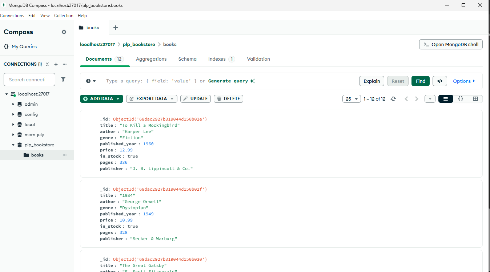

# 📚 MongoDB Assignment – Week 1

## ▶️ How to Run the Scripts

### 1. Insert sample books
Run this script first to populate the database with sample data:
```bash
node insert_books.js

## ▶️ Step 2: Run queries automatically
```bash
node queries.js


# 📸 Screenshots

Here is a screenshot of my MongoDB Compass showing the `plp_bookstore` database and the `books` collection:

